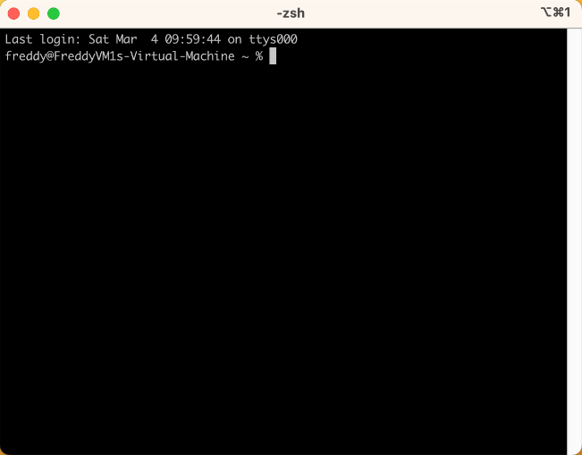
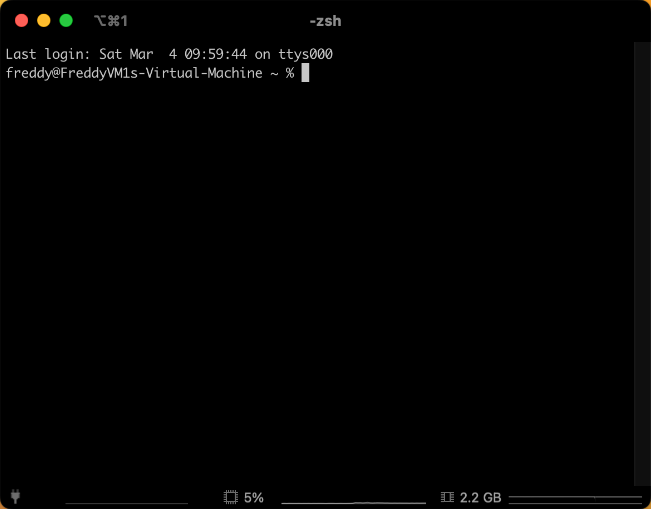

# iTerm2 - Terminal

`iTerm2` is a terminal emulator application for macOS that provides a more powerful and customizable alternative to the default macOS `Terminal`.
It is an open-source application that offers a variety of features for working with command-line interfaces, such as split panes, search, autocomplete and more.

## Installation

```bash
brew install --cask iterm2
```

Close the `terminal` application and open `iTerm` instead.
Any time I refer to the terminal in these guides, I mean the `iTerm2` application.

## Setup

With the `iTerm` application open, go to `Preferences` and select the `Appearance` tab.
Within the `General` tab, set `Theme` to `Minimal`, and `Status Bar` to `Bottom`.



In the `Profiles` tab, select the `Session` tab, and then check `Status bar enabled` at the bottom of the window and then click the `Configure Status Bar` button.


I like to have the `Battery Level`, `CPU Utilization`, `Memory Utilization`, `Network Throughput` in my status bar.



## Return

[Return to the top-level README](./../../README.md)
